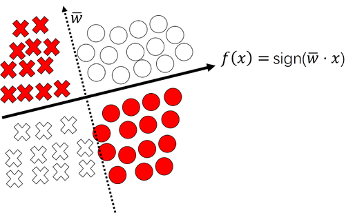

# 感知机 (Perceptron Learning Algorithm, PLA)

## 简介
感知机（perceptron）是二分类的线性分类模型，其输入为实例的特征向量$x \in R^{n}​$，输出为实例的类别$y​$，取+1和-1二值。感知机对应于输入空间（特征空间）中将实例划分为正负两类的分离超平面，属于判别模型，解决的问题是分类问题。为了求出将训练数据进行线性划分的分离超平面，模型中引入误分类的损失函数，利用梯度下降法对损失函数进行最小化，从而求得感知机模型。

总的来说：

- 模型：符号函数（判别模型）
- 策略：损失函数：误分点到超平面距离之和
- 算法：利用梯度下降算法进行优化

## 定义
假设输入空间（特征空间）是$x \in R^{n}$， 输出空间是$Y = \{+1, -1\}$ 。$x$输入表示实例的特征向量，对应于输入空间（特征空间）的点；输出$y$表示实例的类别。由输入空间到输出空间的函数 $ f(x) = sign(w \cdot x +b) $称为感知机。其中，$w$和$b$为感知机的模型参数，$w \in R^n$叫作权值(weight)，$b \in R$叫做偏置(bias)，$\cdot $表示$w$和$x $的内积。

$sign()​$是符号函数：$ sign(x) = \left \{  \begin{array}{lr}  1,  &x \ge 0 \\ -1,& otherwise  \end{array}  \right . ​$

感知机是一种线性分类模型，属于判别模型。感知机模型的假设空间是定义在特征空间中的所有线性分类模型或者线性分类器，即函数集合：$\{f|f(x)=w \cdot x+b\}$。

## 学习策略

### 从梯度下降的角度

对于误分类点$x_i \in M​$，其中$M​$是误分类点的集合，构造点到直线（分离超平面）距离的误差函数：

$L = \sum_{x_i \in M} \dfrac{-y_i(w \cdot x_i + b)}{ \begin{Vmatrix} w \end{Vmatrix}}​$

进一步的，我们忽略分母$\begin{Vmatrix} w\end{Vmatrix} $，可以得到$L = \sum_{x_i \in M} -y_i(w \cdot x_i + b) $

损失函数$L$对参数$w$和$b$的导函数为：

$\dfrac{\part L}{\part w} = -\sum_{x_i \in M}y_ix_i $

$\dfrac{\part L}{\part b}= -\sum_{x_i \in M}y_i $

如果使用梯度下降法，可以得到更新参数$w$与$b$的公式：

$w := w - \eta \dfrac{\part L}{\part w}  $，$b := b - \eta \dfrac{\part L}{\part b} $，其中$\eta$是学习率。

这里使用的是随机梯度下降法 (sgd)，也就是针对每个误分类点进行更新：

$w := w + \eta y_ix_i  $

$b := b + \eta y_i$

###  从几何的角度

图中$\bigcirc​$代表标签是+1的样本点，$\times​$代表标签是-1的样本点. $\textcolor{red}{红色}​$的样本点是误分类点。

对于任意误分类点来说，我们希望超平面向着$\textcolor{red}{误分类点}$移动。所以要调整超平面的法向量$\bar w$：
- 对于$\textcolor{red}{\bigcirc }$, $\bar w$应该向着靠近它的方向移动：$\bar w = \bar w + \eta x_{\textcolor{red}{\bigcirc}} $
- 对于$\textcolor{red}{\times }​$, $\bar w​$应该向着远离它的方向移动：$\bar w = \bar w - \eta x_{\textcolor{red}{\times}} ​$

因为$\textcolor{red}{\bigcirc }$的标签是+1, 而$\textcolor{red}{\times }$的标签是-1。综上可以得到对于$x_i \in M$, 更新策略为：$\bar w := \bar w +\eta y_i x_i$

## PLA的收敛性

易，请参看《统计学习方法》。

## PLA的对偶

易，请参看《统计学习方法》。

## 参考资料

《统计学习方法》
